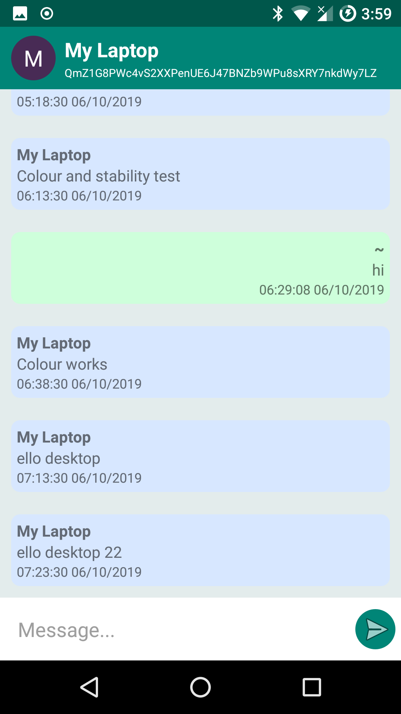
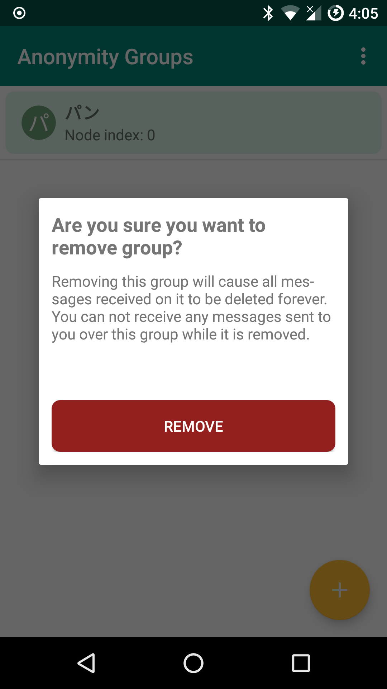

# DistoRt Client  

### About
This is the reference implementation for an Android client for DistoRt, a platform for providing anonymous and 
encrypted messaging between peers (designed by [JS Légaré](https://github.com/init-js)). 
Large anonymity groups are used to obscure the intended recipient of a message, 
and modern encryption schemes are used to ensure confidentiality.
The client allows for interacting with a [DistoRt homeserver](https://github.com/ryco117/distort-server) 
remotely through the server's REST API. Supports both HTTP and HTTPS homeserver authentication. 
User installed certificates are trusted during HTTPS requests, so that if users  create self-signed 
certificates for their homeserver, then the client will be able to accept the certificate 
if the user manually installs it to their Android device.

### Images
* #### Login
    
* #### Messaging 
    
* #### Notifications
    
* #### Leave Group
    
* #### Display Account as QR Code
    
* #### Read Peer Accounts as QR Codes
    
